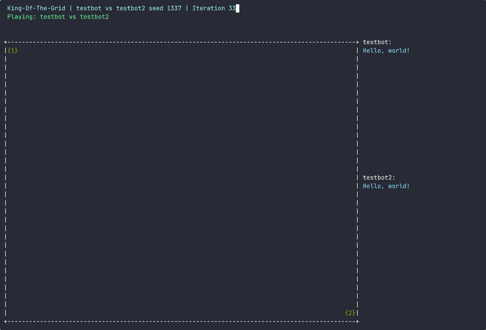

# King Of The Grid

*A Z80 Sandbox Competition Game* in which developers can write
bots to compete on the most efficient algorithm to be King Of The Grid!

<div align="center">
  <br/>
  Example of a single competition.
</div>

# Game Rules

* See [rules.cpp](src/rules.cpp) for exact rules (how often, what values etc).
* World size: 32x32 cells
* Two bots (or programs) spawn in top-left and bottom-right corners
* Each bot has a set of energy. See [rules.cpp](src/rules.cpp) for exact values.
* Bots run on Z80 CPU. See CPUs section.
* Food (static) and prey (moves) are spawned periodically.
* Food is not spawned evenly: random noise is applied using [FastNoiseLite](https://github.com/Auburn/FastNoiseLite) on rules described on [seasons.cpp](src/seasons.cpp)
* Both can move around, eat, scan environment and clone themselves. See [bot_api.h](bot-api/bot_api.h)
* Bot that survives the longest, wins.
* If both bots survive for too long, it's a draw.

# Live demo

See [speccytools.org/kotg](https://speccytools.org/kotg/)

# Easiest: build and run web version

Web version can be built with [Emscripten framework](https://emscripten.org/docs/getting_started/downloads.html).

```bash
make kotg-web
cd bin
python3 -m http.server 8000
# Open http://localhost:8000/kotg.html in browser
```

# How to build the game in command line

* Have `cmake` and `gcc` installed.
* `git submodule update --init --recursive`
* Do `make`
* To test an [example bot](./examples/test-bot) do `make testbot`. This example
  runs the bot against itself.

# How to run

## Single session:

Go into folder with two (or one) of your programs, they must have `.bin` extension.

Run: `kotg <program1> [<program2>] [<seed>]`.

Game outputs files `recording-xxx.txt`, which you can play with [asciinema](https://asciinema.org/):
```bash
asciinema play recording-xxx.txt
# or, to share the game on the web
asciinema upload recording-xxx.txt
```

## Mass session:

Have all your programs (2+) placed into current folder.

Run `kotg`

In this mode, each pair of programs will play against one another twice on the same seed.
That way both bots have a chance.

Any game session can be replicated. Given a session outcome AAA BBB 1338, you can just pass these arguments to kotg
and play the game again.

## What is `seed`

Every game is deterministic: given two programs and a seed, it will play out exactly the same.
That way, when you loose in a mass session, you can replicate the session with your target in order to 
adjust to your opponent's behavior.

# Watching the results

Game outputs files `<a>-<b>-<seed>.txt` which you can play using [asciinema.org](https://asciinema.org/):

```bash
asciinema play <a>-<b>-<seed>.txt
```

Export `KOTG_AUTOPLAY=1` to play results automatically.
Export `KOTG_AUTOUPLOAD=1` to upload them automatically with a review URL.

# CPUs

* Each bot runs on a Z80-equipped virtual machine, with limited Z80-ticks per game tick. So if your bot thinks a lot,
  it is going to be outrun.
* Bots can perform action according to API. See [bot_api.h](bot-api/bot_api.h)
* `printf` is supported for debugging.
* Each action consumes energy.
* When bot decides to take action, execution stops until action is done.
* Program address starts at address 8192, and program can be of size of up to 65536-8192=57344
* First 8192 (0x0000 - 0x1FFF) of memory are SHARED across all bots. That way they can communicate.
* Bots can clone (or fork) themselves in order to spread, fork-bomb style, or hibernate to preserve energy.

<table>
<tr>
<th>Memory Region</th>
<th>Description</th>
</tr>
<tr>
<td>0x0000 - 0x1FFF</td>
<td>Shared memory across all friendly bots
<tr>
<td>0x2000 - 0xFFFF</td>
<td>Program memory</td>
</tr>
</table>

# How to write your Bot

* [Download z88dk](https://github.com/z88dk/z88dk/releases) or install z88dk from sources:
  ```bash
  git clone https://github.com/z88dk/z88dk.git
  cd z88dk
  git submodule update --init --recursive
  ./build.sh -p test
  sudo make install
  ```

* See [example bot](./examples/test-bot) for an example on how to build with C and z88dk
* If you prefer assembly, see section below.

# I don't like z88dk or C for that matter

* Make sure your code has base address (`.ORG`) of 8192.
* For communication, see below.
* Other than that, your bot can do whatever!

See [bot_api.c](bot-api/bot_api.c) on how bot interacts with the world.

To call a system call, load call number into register a `A` and them do

```asm
defb $ED, $FE
```

This is an illegal z80 instruction that emulator will understand and stop exection to process
your input. Both input (like energy) and output are taken/returned into argument `HL`.

See line 10 for exact syscall codes.

## stdout

To print a character, do syscall `1`:

```asm
ld a, 1
ld l, 'H'
defb $ED, $FE
```

# How to debug your bot

* `printf`s are supported
* GDB support can be added if project kicks off.
